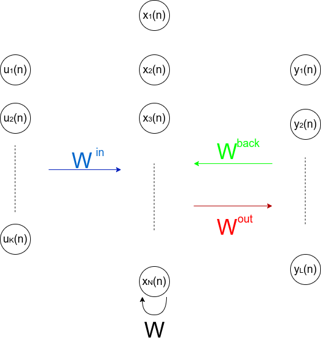
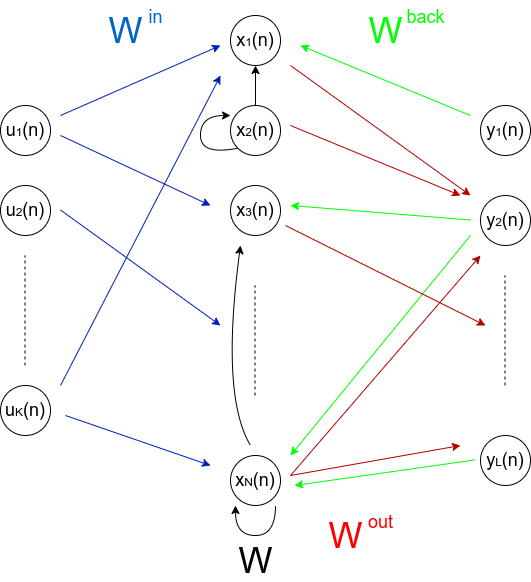

# Reservoir computing for learning the underlying dynamics of sequential data

This project is the result of the Final Thesis of the Master's Degree in the _Fundamental Principles of Data Science_, at the University of Barcelona, supervised by Dr. Oriol Pujol.

_Reservoir computing (RC)_ is a learning technique used to infer the underlying dynamics given a set of sequential data points. For instance, it may learn the dynamics of an input sequence in order to produce a related output sequence or it may learn the dynamics of a certain data in order to be capable of predicting the following time steps. The neural network employed is composed by a single hidden layer along with an input and output layers. All the connections between these three elements are allowed, although it is usually enough to regard connections between the input and the hidder layer (), the hidden layer and the output (), the hidden layer with itself (_W_) and the output with the hidden layer ().

<figure class="image">

<figcaption>Topology of the neural network employed by the reservoir computing framework. The left image depicts the general structure whereas the right one illustrates a particular realization of the left one.</figcaption>
</figure>

As we will see, reservoir computing is a recurrent neural network approach but with the main difference that it deterministically sets all the connections within the different components of the network (,_W_,) with the exception of the output connections (), since these will be the connections to be learnt. This is possible because of the so called _echo states_, which is the key concept behind the reservoir computing approach. Therefore, reservoir computing needs to learn a much lower number of parameters, which makes it computationally cheaper than other RNN approaches. However, this is not the only difference. As we will see, the learning procedure consists on performing a linear regression, which is less costly than the usual backpropagation.

The reservoir computing technique has recently gained a lot of popularity thanks to the work of chaos theorist Edward Ott and four collaborators at the University of Maryland in the area of chaotic dynamical systems (\cite{PhysRevLett} and \cite{ChaosMag}). In that work, they were able to predict the dynamics of some chaotic systems up to 8 Lyapunov times, which is an impressive distant horizon. Notice that the network was trained solely based on past data, thus no knowledge requiring the model generating such dynamics was required. The prediction of chaotic dynamics based solely on past data may have a wide range of applications: monitor the heartbeat in order to prevent a heart attack, keep track of a sea's swell in order to predict rough waves that may endanger a ship and its crew, track solar flares in order to predict solar storms that would severely damage Earth's electronic infrastructure and whether forecasting among others.

The main goal of the project is to understand the mechanism behind the _reservoir computing (RC)_ technique as well as its implementation in the task of learning a dynamics in order to predict the following time steps. We will deal with chaotic and non-chaotic dynamics.

## Structure of the repository

#### Intuition_EchoStates.ipynb
The main goal of this notebook is to provide an insight on how an _echo states network_ works. Moreover, the training of a toy example is performed in order to understand such procedure.  
These experiments are explained in Chapter 2 of the report.

#### Periodic_Spiking_Dynamics.ipynb
In this notebook, we train an echo states network in order to make it capable of learning a periodic dynamics and a multiple attractor dynamics. In the former, the network has to be able of cyclically generating a periodic sequence whereas, on the latter, the network needs to learn a dynamics that jumps over different attractors. 
These experiments are explained in Chapter 3 of the report.

#### MackeyGlass.ipynb
In this notebook we learn the chaotic dynamics of the so called Mackey-Glass system. The main goal is to train the network with past data in order to make it capable of predicting the following time steps.  
These experiments are explained in Chapter 4 of the report.

#### StandardMap.ipynb
In this notebook we learn the dynamics of the so called Standard Map. Again, the main goal is to train the network with past data in order to make it capable of predicting the following time steps.  
These experiments are explained in Chapter 5 of the report.

#### StandardMap_Parallel.ipynb
In this notebook we also aim to learn the dynamics of the standard map, but by means of a different approach within the reservoir computing framework. Such approach consists on training various reservoirs in parallel.  
These experiments are explained in Chapter 5 of the report.

#### TFM_report.pdf
Report of the final thesis in pdf format.

#### Webs folder
This folder contains the web pages appearing in the bibliography of the report printed in pdf. Therefore, they can still be consulted in case they get removed from the web.
